# Download

Users are strongly recommended to read through the [User Manual](UserManual). It will help clarify some technical details that can help avoid unnecessary errors when dealing with multi-modal data.

## Calibration

The calibrated parameters for the sensorsuites are provided in the following yaml files:

[All-Terrain Vehicle](https://drive.google.com/file/d/1zVTBqh4cA1DciWBj5n7BGiexbfan1BBL) (for **ntu_** sequences)

[Handheld Setup](https://drive.google.com/file/d/1htr26EE-Y1sHS5J4zaSbauC1XFgIh3Ym) (for **kth_** and **tuhh_** sequences)

## ROS bags
The sequences are captured as rosbags, which are then compressed with bz2 method. User can uncompress the rosbags for less CPU usage at the cost of 3x memory storage.
We also split the data into different bags based on the sensor type. User can freely select the combo that suits their interest. Ground truth is kept in a seperate folder. Please click on the figure to get the link to it.

<table border="1" class="tg" style="undefined;table-layout: fixed;text-align:center">
  <colgroup>
		<col style="width: 8px">
		<col style="width: 150px">
		<col style="width: 420px">
		<col style="width: 100px">
		<col style="width: 100px">
		<col style="width: 100px">
		<col style="width: 100px">
		<col style="width: 100px">
		<col style="width: 100px">
		<col style="width: 100px">
		<col style="width: 100px">
	</colgroup>
	<thead>
    <tr style="text-align: right;">
      <th class="tg-mypc">#</th>
      <th class="tg-mypc">SeqID</th>
      <th class="tg-mypc">Ground Truth</th>
      <th class="tg-mypc">D435i</th>
      <th class="tg-mypc">D455 bottom</th>
      <th class="tg-mypc">D455 top</th>
      <th class="tg-mypc">Livox</th>
      <th class="tg-mypc">Ouster</th>
      <th class="tg-mypc">UWB</th>
      <th class="tg-mypc">VN100</th>
      <th class="tg-mypc">VN200</th>
    </tr>
  </thead>
  <tbody>
    <tr>
      <th class="tg-mypc">0</th>
      <td><a href="https://drive.google.com/drive/folders/1nJxVwgR35p8i0iR1sfcaiHpaXpLpCF8c" rel="noopener noreferrer" target="_blank">ntu_day_01 </a>   Duration: 10m2s   Size: 41.5 GB</td>
      <td><a href="https://drive.google.com/drive/folders/1ubgZ6djQF_e1_mZKbxYpH7v4AsGxhgXa"> 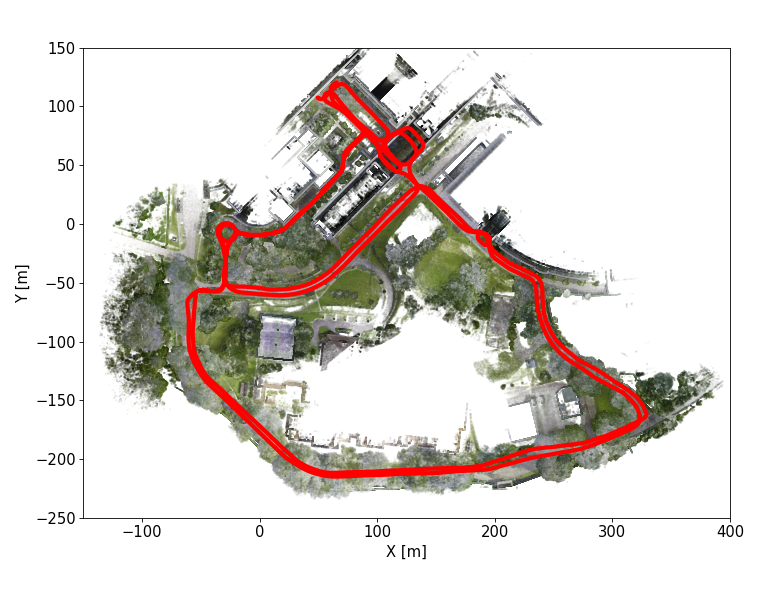</a></td>
      <td><a href="https://drive.google.com/file/d/1E4oTZKaajNJA8KT9hcOsREU4If2mAHle" rel="noopener noreferrer" target="_blank">d435i (13.3 GB)</a></td>
      <td><a href="https://drive.google.com/file/d/1u7nmGxrm0LJyIiYKPincojHcBOEw59kh" rel="noopener noreferrer" target="_blank">d455b (13.8 GB)</a></td>
      <td>-</td>
      <td><a href="https://drive.google.com/file/d/1p7JCvUKh9BgKNPnt-SeC7oQgZ4S863KQ" rel="noopener noreferrer" target="_blank">mid70 (542 MB)</a></td>
      <td><a href="https://drive.google.com/file/d/127Rk2jX4I95CEWK1AOZRD9AQRxRVlWjY" rel="noopener noreferrer" target="_blank">os1_128 (13.8 GB)</a></td>
      <td><a href="https://drive.google.com/file/d/1FkEX5U8pE7XWzU70ni-0-DpGFFlIMcd-" rel="noopener noreferrer" target="_blank">ltpb (1 MB)</a></td>
      <td><a href="https://drive.google.com/file/d/1bBKRlzwG4v7K4mBmLAQzfwp_O6yOR0Ld" rel="noopener noreferrer" target="_blank">vn100 (32 MB)</a></td>
      <td><a href="https://drive.google.com/file/d/1Cm5oHSq4OkWAzEUsq2qUMZA0Uq19QR_B" rel="noopener noreferrer" target="_blank">vn200 (54 MB)</a></td>
    </tr>
    <tr>
      <th class="tg-mypc">1</th>
      <td><a href="https://drive.google.com/drive/folders/1Nt_khn7u8y3d1TIjY8Lyht2vI8qCG6Sy" rel="noopener noreferrer" target="_blank">ntu_day_02 </a>   Duration: 3m49s   Size: 14.8 GB</td>
      <td><a href="https://drive.google.com/drive/u/1/folders/1e2VCn7PxlSbVsRLagbtUBU35TeylD93D"> 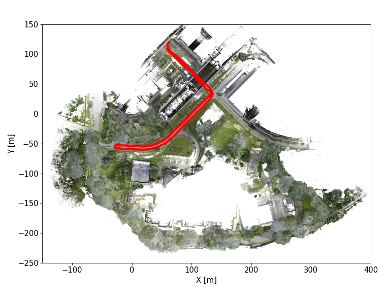</a></td>
      <td><a href="https://drive.google.com/file/d/1svtLKBcoxixWZjatwSP1MtJEmVTPE3wA" rel="noopener noreferrer" target="_blank">d435i (4.7 GB)</a></td>
      <td><a href="https://drive.google.com/file/d/1sfQdn6MGt4BsSx6PQtDdMZSiwfFcsihk" rel="noopener noreferrer" target="_blank">d455b (4.9 GB)</a></td>
      <td>-</td>
      <td><a href="https://drive.google.com/file/d/1y5vLjnwNI1Aj0uMp3HCsHm-HOfZbBC5h" rel="noopener noreferrer" target="_blank">mid70 (196 MB)</a></td>
      <td><a href="https://drive.google.com/file/d/1jDS84WvHCfM_L73EptXKp-BKPIPKoE0Z" rel="noopener noreferrer" target="_blank">os1_128 (5.0 GB)</a></td>
      <td><a href="https://drive.google.com/file/d/1a31zWxJK-OgqP6z4IV4WudF2DbcjYRxY" rel="noopener noreferrer" target="_blank">ltpb (400 KB)</a></td>
      <td><a href="https://drive.google.com/file/d/1FHsJ1Hosn_j4m5KivJrdtECdFEj3Is0G" rel="noopener noreferrer" target="_blank">vn100 (12 MB)</a></td>
      <td><a href="https://drive.google.com/file/d/1wo1rUuzqDkvFMhXJhx9fnNtn6uyh_F7z" rel="noopener noreferrer" target="_blank">vn200 (25 MB)</a></td>
    </tr>
    <tr>
      <th class="tg-mypc">2</th>
      <td><a href="https://drive.google.com/drive/folders/1IqB9k_5TQU4xVhQD060XB-T1ISORCeEE" rel="noopener noreferrer" target="_blank">ntu_day_10 </a>   Duration: 5m25s   Size: 20.9 GB</td>
      <td><a href="https://drive.google.com/drive/u/1/folders/18sthXHBMw95V0TemGv4_dRR4WVwYKLf7"> 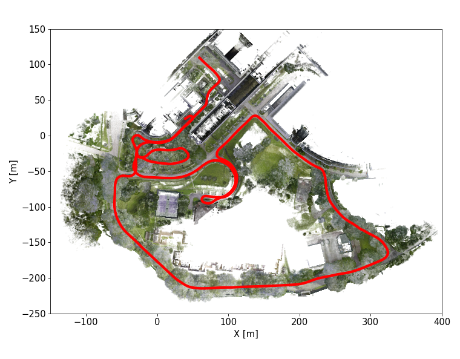</a></td>
      <td><a href="https://drive.google.com/file/d/1EyC3I7jIO-5ca5qrYxE4eoD1qTRKkOo5" rel="noopener noreferrer" target="_blank">d435i (6.5 GB)</a></td>
      <td><a href="https://drive.google.com/file/d/1eGdELGvE2uCq063EexoK9E7I1hF3_Eke" rel="noopener noreferrer" target="_blank">d455b (6.8 GB)</a></td>
      <td>-</td>
      <td><a href="https://drive.google.com/file/d/10Pmtu6SlBGd2gzvu8OHm96eRVbR4lOTB" rel="noopener noreferrer" target="_blank">mid70 (294 MB)</a></td>
      <td><a href="https://drive.google.com/file/d/1p18Fa5SXbVcCa9BJb_Ed8Fk_NRcahkCF" rel="noopener noreferrer" target="_blank">os1_128 (7.3 GB)</a></td>
      <td><a href="https://drive.google.com/file/d/1eoW4cn-K78kUzjJu_ogtYWE4BIVR0f2l" rel="noopener noreferrer" target="_blank">ltpb (602 KB)</a></td>
      <td><a href="https://drive.google.com/file/d/14IydATXlqbJ0333iNY7H-bFDBBBYF-nC" rel="noopener noreferrer" target="_blank">vn100 (18 MB)</a></td>
      <td>-</td>
    </tr>
    <tr>
      <th class="tg-mypc">3</th>
      <td><a href="https://drive.google.com/drive/folders/1gi18OHqGDTNO-ZkRjP0_wJ5jizResVO-" rel="noopener noreferrer" target="_blank">ntu_night_04 </a>   Duration: 4m57s   Size: 22.1 GB</td>
      <td></td>
      <td><a href="https://drive.google.com/file/d/1Uwhwi41yzPeAWCOmhNJlcaLM1PI8x-nh" rel="noopener noreferrer" target="_blank">d435i (6.7 GB)</a></td>
      <td><a href="https://drive.google.com/file/d/13kmnVVPhTmOHJeuNu50A60x_bC5nchT5" rel="noopener noreferrer" target="_blank">d455b (8.4 GB)</a></td>
      <td>-</td>
      <td><a href="https://drive.google.com/file/d/1PlZMdVOMpJPxzdgb3uTDC4-REqmxQUXj" rel="noopener noreferrer" target="_blank">mid70 (266 MB)</a></td>
      <td><a href="https://drive.google.com/file/d/1k9olfETU3f3iq_9QenzEfjTpD56bOtaV" rel="noopener noreferrer" target="_blank">os1_128 (6.7 GB)</a></td>
      <td><a href="https://drive.google.com/file/d/1QTVHDloE-PBGf9nA8NRXsKB4NVN4r5gT" rel="noopener noreferrer" target="_blank">ltpb (561 KB)</a></td>
      <td><a href="https://drive.google.com/file/d/1dLvaCBmac-05QtPy-ZsiU6L5gY35Z_ii" rel="noopener noreferrer" target="_blank">vn100 (16 MB)</a></td>
      <td><a href="https://drive.google.com/file/d/1jR4qC2WEANisd_c1b8UEc01rGYOxuOpP" rel="noopener noreferrer" target="_blank">vn200 (33 MB)</a></td>
    </tr>
    <tr>
      <th class="tg-mypc">4</th>
      <td><a href="https://drive.google.com/drive/folders/1UGyFtPRjDiGDUDfq4iXHiPU1EzilF2HI" rel="noopener noreferrer" target="_blank">ntu_night_08 </a>   Duration: 7m47s   Size: 31.9 GB</td>
      <td><a href="https://drive.google.com/drive/u/1/folders/18z9NCxrI7Dr4N6q8P6y4FFRIuofJav6f"> 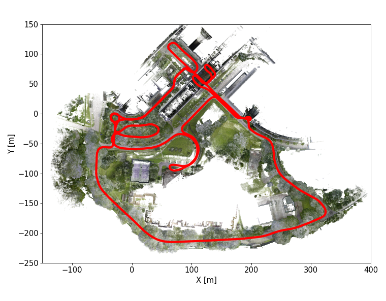</a></td>
      <td><a href="https://drive.google.com/file/d/19sVbwKINJjHRWtbGZu-Sgxj4GHbAMZvR" rel="noopener noreferrer" target="_blank">d435i (8.0 GB)</a></td>
      <td><a href="https://drive.google.com/file/d/1FSDLGZzZtXibRwyLarjO6pF4FOgeQYC3" rel="noopener noreferrer" target="_blank">d455b (12.9 GB)</a></td>
      <td>-</td>
      <td><a href="https://drive.google.com/file/d/1BjThXtxFt1pnqqE7Fq7Ytn0mPrQGZ427" rel="noopener noreferrer" target="_blank">mid70 (427 MB)</a></td>
      <td><a href="https://drive.google.com/file/d/1BbtBDwT3sLCHCOFfZWeVVWbG72mWq8x8" rel="noopener noreferrer" target="_blank">os1_128 (10.5 GB)</a></td>
      <td><a href="https://drive.google.com/file/d/1CsM-OieMxO11XgVTki31aIiGDFviSA84" rel="noopener noreferrer" target="_blank">ltpb (823 KB)</a></td>
      <td><a href="https://drive.google.com/file/d/1oTUfLaQO9sUjesg6Bn3xbSZt3XgQqVRo" rel="noopener noreferrer" target="_blank">vn100 (25 MB)</a></td>
      <td><a href="https://drive.google.com/file/d/1U_7zuoTPC9QCHfeulPMIKw9e7C2i9W0r" rel="noopener noreferrer" target="_blank">vn200 (42 MB)</a></td>
    </tr>
    <tr>
      <th class="tg-mypc">5</th>
      <td><a href="https://drive.google.com/drive/folders/1samHxI8NdM73uOtLT7KSPFbLppU1ffGy" rel="noopener noreferrer" target="_blank">ntu_night_13 </a>   Duration: 3m54s   Size: 17.3 GB</td>
      <td><a href="https://drive.google.com/drive/u/1/folders/11eORR0sbmNJzY_Vd7P5v52V3OVPYLqLp"> 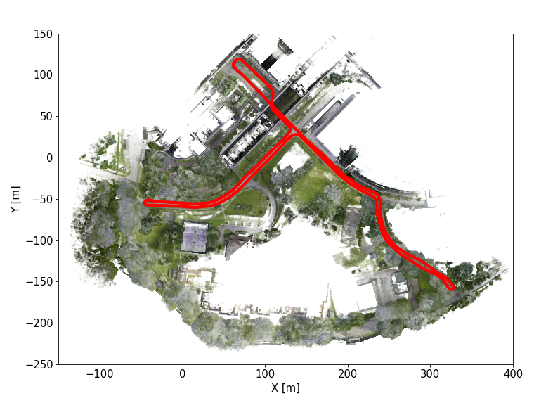</a></td>
      <td><a href="https://drive.google.com/file/d/1q9p1wj9WsZS8xOFL9Uad9RKe-chfmahB" rel="noopener noreferrer" target="_blank">d435i (5.5 GB)</a></td>
      <td><a href="https://drive.google.com/file/d/13iEg1GRRqnyddGz4yVugflwK4Ayoy1DN" rel="noopener noreferrer" target="_blank">d455b (6.6 GB)</a></td>
      <td>-</td>
      <td><a href="https://drive.google.com/file/d/1Qa9aSr58cJUAXjrgMqZ9P_Kv9d_z94M8" rel="noopener noreferrer" target="_blank">mid70 (200 MB)</a></td>
      <td><a href="https://drive.google.com/file/d/17Fn_HRVwSEzQqXwkw0J3NnqxekUMjnYI" rel="noopener noreferrer" target="_blank">os1_128 (5.0 GB)</a></td>
      <td><a href="https://drive.google.com/file/d/1ebR3PtgZ0SrmVhJSbqFh-0AGXif39ogH" rel="noopener noreferrer" target="_blank">ltpb (432 KB)</a></td>
      <td><a href="https://drive.google.com/file/d/1lru1JVyjfzM_QmctEzMtgD6ps8ib5xYs" rel="noopener noreferrer" target="_blank">vn100 (13 MB)</a></td>
      <td><a href="https://drive.google.com/file/d/1bI3Je2Py14zBXbNW8_tOAeKlFT9xWGid" rel="noopener noreferrer" target="_blank">vn200 (24 MB)</a></td>
    </tr>
    <tr>
      <th class="tg-mypc">6</th>
      <td><a href="https://drive.google.com/drive/folders/1k5nQ81_1nA1Ng8IlQ1SghwBNmIUgbS0o" rel="noopener noreferrer" target="_blank">kth_day_06 </a>   Duration: 14m51s   Size: 43.0 GB</td>
      <td><a href="https://drive.google.com/drive/u/1/folders/1hEGWDSyocmeubxHKfjATNHkfd1wqZCn5"> 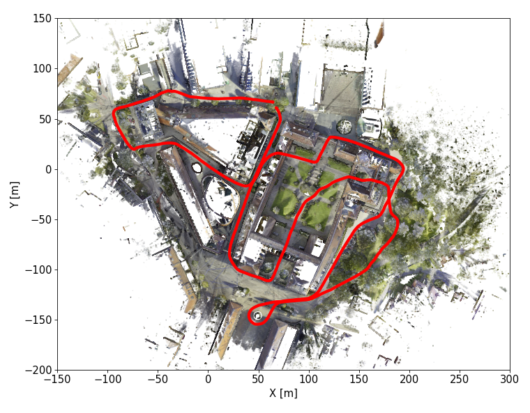</a></td>
      <td>-</td>
      <td><a href="https://drive.google.com/file/d/1kZZhhqXT_pXLvLhlfGl5Ip4XpLCHF6_e" rel="noopener noreferrer" target="_blank">d455b (16.2 GB)</a></td>
      <td><a href="https://drive.google.com/file/d/1j_SfAzs3jZJOUmV-DA11Ixrln00pNb5x" rel="noopener noreferrer" target="_blank">d455t (16.4 GB)</a></td>
      <td><a href="https://drive.google.com/file/d/1X1fAdHPMXN5oYhtT6VsSZIppzTe9Ttda" rel="noopener noreferrer" target="_blank">mid70 (778 MB)</a></td>
      <td><a href="https://drive.google.com/file/d/1DHpRSoY5ysK1h2nRwks_6Sz-QZqERiXH" rel="noopener noreferrer" target="_blank">os1_64 (9.6 GB)</a></td>
      <td><a href="https://drive.google.com/file/d/1a2o-vQFK0vC0QqbXyM41BnzSNH9VkQ6N" rel="noopener noreferrer" target="_blank">ltpb (1 MB)</a></td>
      <td>-</td>
      <td><a href="https://drive.google.com/file/d/1cf_dmcFAX9-5zxB8WcFVc3MaVNczEMqn" rel="noopener noreferrer" target="_blank">vn200 (56 MB)</a></td>
    </tr>
    <tr>
      <th class="tg-mypc">7</th>
      <td><a href="https://drive.google.com/drive/folders/17bE6-s3QjB7JJlmPYNLsJkTQgnHTeEyr" rel="noopener noreferrer" target="_blank">kth_day_09 </a>   Duration: 12m47s   Size: 23.4 GB</td>
      <td></td>
      <td>-</td>
      <td><a href="https://drive.google.com/file/d/1fGxxe5JGvkNC-BVyHeLdLfdTNkhTPC9i" rel="noopener noreferrer" target="_blank">d455b (7.1 GB)</a></td>
      <td><a href="https://drive.google.com/file/d/1yyrmxYYENBe5jmsfH6vONhvywB71Tzf8" rel="noopener noreferrer" target="_blank">d455t (7.3 GB)</a></td>
      <td><a href="https://drive.google.com/file/d/1LLEbZ244oicynIL4gjin7251ceo6IAgQ" rel="noopener noreferrer" target="_blank">mid70 (687 MB)</a></td>
      <td><a href="https://drive.google.com/file/d/1mhMpwr3NDYfUWL0dVAh_kCTTTLFen31C" rel="noopener noreferrer" target="_blank">os1_64 (8.3 GB)</a></td>
      <td><a href="https://drive.google.com/file/d/1yR9vVANK8jT5L35R3ilgI8ChDnA2nzhl" rel="noopener noreferrer" target="_blank">ltpb (1 MB)</a></td>
      <td>-</td>
      <td><a href="https://drive.google.com/file/d/16j2Ud99lrgkNtIlPQ_OV6caqZZc-bHA-" rel="noopener noreferrer" target="_blank">vn200 (48 MB)</a></td>
    </tr>
    <tr>
      <th class="tg-mypc">8</th>
      <td><a href="https://drive.google.com/drive/folders/1bhGBi9DqoCxtqY3hbz666kCBuxVIwXQT" rel="noopener noreferrer" target="_blank">kth_day_10 </a>   Duration: 10m15s   Size: 27.3 GB</td>
      <td></td>
      <td>-</td>
      <td><a href="https://drive.google.com/file/d/1ww7LdYTnWgsQJ5YI4YgCkvdjIQBBn9Vp" rel="noopener noreferrer" target="_blank">d455b (10.0 GB)</a></td>
      <td><a href="https://drive.google.com/file/d/1X2Sbzm-zFKhE7MW9-dNJrv-2eyD2iFuh" rel="noopener noreferrer" target="_blank">d455t (10.1 GB)</a></td>
      <td><a href="https://drive.google.com/file/d/19BiksWKakCinCq9FuYf203RY620R32cI" rel="noopener noreferrer" target="_blank">mid70 (525 MB)</a></td>
      <td><a href="https://drive.google.com/file/d/1NbOHfVaCZkXPz28VwLrWLfITXYn25odh" rel="noopener noreferrer" target="_blank">os1_64 (6.7 GB)</a></td>
      <td><a href="https://drive.google.com/file/d/1Nf5odmAA6sGTPXGBw-h4fR4_VoBDjwJ6" rel="noopener noreferrer" target="_blank">ltpb (876 KB)</a></td>
      <td>-</td>
      <td><a href="https://drive.google.com/file/d/13qyhDyrj6doa7s0cdbtF1e_Bh-erFMUv" rel="noopener noreferrer" target="_blank">vn200 (38 MB)</a></td>
    </tr>
    <tr>
      <th class="tg-mypc">9</th>
      <td><a href="https://drive.google.com/drive/folders/1YZTvQ1QI86HW8C7Ifq6VFC02fQRtMMCw" rel="noopener noreferrer" target="_blank">kth_night_01 </a>   Duration: 16m9s   Size: 43.7 GB</td>
      <td></td>
      <td>-</td>
      <td><a href="https://drive.google.com/file/d/1xouzt8EHb9IlO_koXr_VsCwLh7qhUjyD" rel="noopener noreferrer" target="_blank">d455b (18.0 GB)</a></td>
      <td><a href="https://drive.google.com/file/d/1dQ1EgGcMePdEfXrtXyjVvyWgZSgVFNJz" rel="noopener noreferrer" target="_blank">d455t (14.5 GB)</a></td>
      <td><a href="https://drive.google.com/file/d/1jWp2THLV2v51a7APTUhbqVCH7z6Crtg_" rel="noopener noreferrer" target="_blank">mid70 (855 MB)</a></td>
      <td><a href="https://drive.google.com/file/d/1mbLMoTPdhUI9u-ZOYFQJOYgrcQJb3rvN" rel="noopener noreferrer" target="_blank">os1_64 (10.3 GB)</a></td>
      <td><a href="https://drive.google.com/file/d/1zIHjLy7iHt_VgjHVw5zmIXz6x_g4lMRB" rel="noopener noreferrer" target="_blank">ltpb (1 MB)</a></td>
      <td>-</td>
      <td><a href="https://drive.google.com/file/d/1RMfF_DYxUkP6ImwCK039-qJpzbGKw_m7" rel="noopener noreferrer" target="_blank">vn200 (60 MB)</a></td>
    </tr>
    <tr>
      <th class="tg-mypc">10</th>
      <td><a href="https://drive.google.com/drive/folders/1GJ2ZGsBBwiYY3DHk0XCE9cwV2s-xdM7a" rel="noopener noreferrer" target="_blank">kth_night_04 </a>   Duration: 12m26s   Size: 14.9 GB</td>
      <td><a href="https://drive.google.com/drive/u/1/folders/1re8CP1qP4RgJ0nMfEmsGTcsL6Dw47eNh"> 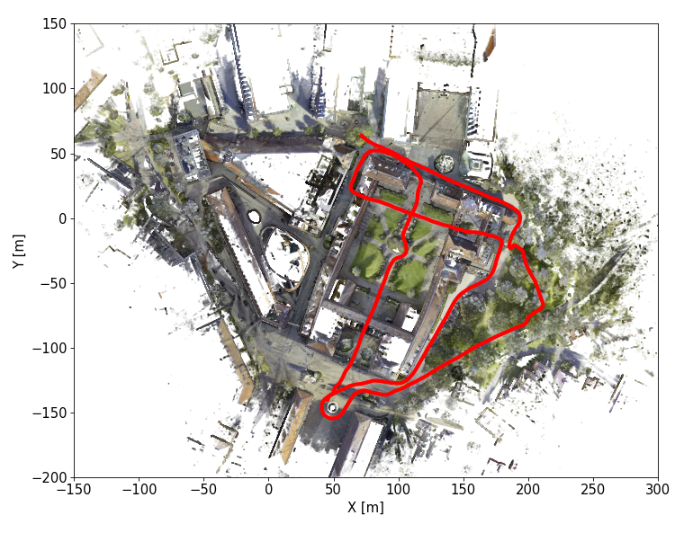</a></td>
      <td>-</td>
      <td><a href="https://drive.google.com/file/d/15NtThX00mL6FIE_pvmoqkYTCisnZ9Ao2" rel="noopener noreferrer" target="_blank">d455b (3.2 GB)</a></td>
      <td><a href="https://drive.google.com/file/d/1HhsSyflVhO1JwOwgiVQv4f39kqRku4RK" rel="noopener noreferrer" target="_blank">d455t (3.2 GB)</a></td>
      <td><a href="https://drive.google.com/file/d/1T4rM9bnsOybm4C24pv4V8SHPOQQGEBMc" rel="noopener noreferrer" target="_blank">mid70 (650 MB)</a></td>
      <td><a href="https://drive.google.com/file/d/1SRMbAu1UyA4lJB4hZdmY-0mic-paGkKF" rel="noopener noreferrer" target="_blank">os1_64 (7.8 GB)</a></td>
      <td><a href="https://drive.google.com/file/d/1XLa2JYsJi5hzHb9trlvpuYot-M-aqCY6" rel="noopener noreferrer" target="_blank">ltpb (1 MB)</a></td>
      <td>-</td>
      <td><a href="https://drive.google.com/file/d/10KIUpaJIID293P3um8OfWWiiQ1NArj2o" rel="noopener noreferrer" target="_blank">vn200 (47 MB)</a></td>
    </tr>
    <tr>
      <th class="tg-mypc">11</th>
      <td><a href="https://drive.google.com/drive/folders/1yK8xOTgZCiWCxcR_lVMKSfVwkgm5XYso" rel="noopener noreferrer" target="_blank">kth_night_05 </a>   Duration: 11m5s   Size: 14.2 GB</td>
      <td><a href="https://drive.google.com/drive/u/1/folders/1ilti3k-l9mtHzxCgR4odC2Mnx7sCVAyZ"> 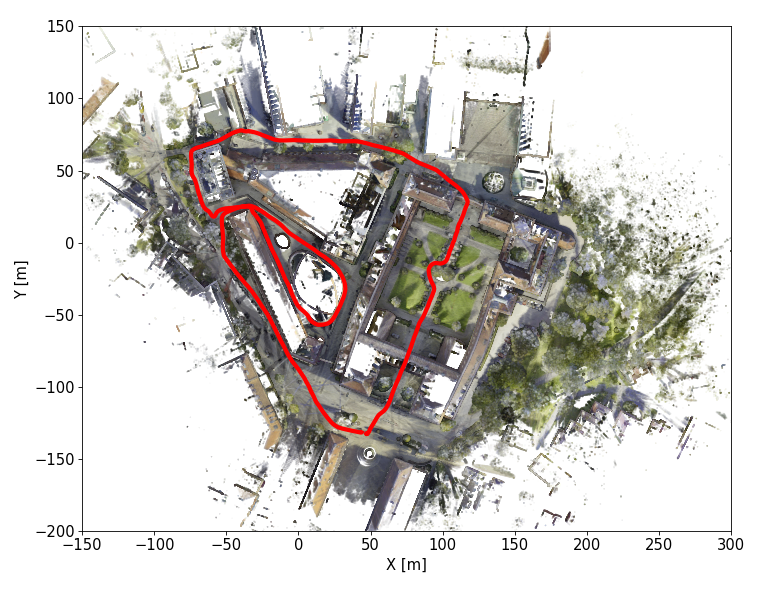</a></td>
      <td>-</td>
      <td><a href="https://drive.google.com/file/d/1YD0s995Js23-en4NDvaHO_ifnfEnPdCq" rel="noopener noreferrer" target="_blank">d455b (3.3 GB)</a></td>
      <td><a href="https://drive.google.com/file/d/1lWzl2fnOGrnXqqEZ4Ye6jIPRtrwa9ifA" rel="noopener noreferrer" target="_blank">d455t (3.3 GB)</a></td>
      <td><a href="https://drive.google.com/file/d/1dTLKWvlx53kxaDsbT3keF3EmzgwfYir-" rel="noopener noreferrer" target="_blank">mid70 (576 MB)</a></td>
      <td><a href="https://drive.google.com/file/d/1m8DYu6y5BkolXkKqC9E8Lm77TpzpyeNR" rel="noopener noreferrer" target="_blank">os1_64 (7.1 GB)</a></td>
      <td><a href="https://drive.google.com/file/d/11iwPLTuBpKOHOzhktcuqAR3hXfh_7GvQ" rel="noopener noreferrer" target="_blank">ltpb (944 KB)</a></td>
      <td>-</td>
      <td><a href="https://drive.google.com/file/d/1_LvH-KVfBOW4ltSo8ERLEHWRb31OoAgW" rel="noopener noreferrer" target="_blank">vn200 (42 MB)</a></td>
    </tr>
    <tr>
      <th class="tg-mypc">12</th>
      <td><a href="https://drive.google.com/drive/folders/19wgO-cuvhmZXxg24eMPrRH69GntI98PH" rel="noopener noreferrer" target="_blank">tuhh_day_02 </a>   Duration: 8m20s   Size: 29.5 GB</td>
      <td><a href="https://drive.google.com/drive/u/1/folders/1tXC4rab1f98UwruunFM5I1Ea9EaRY9KD"> 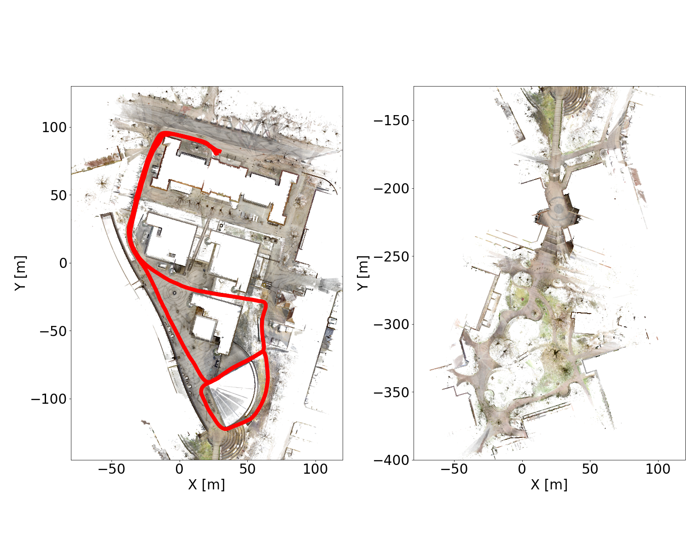</a></td>
      <td>-</td>
      <td><a href="https://drive.google.com/file/d/1T-eZ__o3h7Jctc0XXHfP86FlVQ_sYFHD" rel="noopener noreferrer" target="_blank">d455b (11.8 GB)</a></td>
      <td><a href="https://drive.google.com/file/d/1NQLfz_dWgECWxpCNljHVrrDUUXmR5lfo" rel="noopener noreferrer" target="_blank">d455t (11.8 GB)</a></td>
      <td><a href="https://drive.google.com/file/d/1n_ipXhXEX7RZSHyYrHjimcwA5ZuA7_3_" rel="noopener noreferrer" target="_blank">mid70 (446 MB)</a></td>
      <td><a href="https://drive.google.com/file/d/1LErPETriJjLWhMBE5jvfpxoFujn0Z3cp" rel="noopener noreferrer" target="_blank">os1_64 (5.5 GB)</a></td>
      <td><a href="https://drive.google.com/file/d/1Pga-z5b0yrsVsD-Q5ThZFmmkF9y-1P0R" rel="noopener noreferrer" target="_blank">ltpb (690 KB)</a></td>
      <td>-</td>
      <td><a href="https://drive.google.com/file/d/1N3l-HskmBkta4OQVAneqnJhU29-6IeK8" rel="noopener noreferrer" target="_blank">vn200 (31 MB)</a></td>
    </tr>
    <tr>
      <th class="tg-mypc">13</th>
      <td><a href="https://drive.google.com/drive/folders/1E21qhp4J1BED41cF_2R0Df-_UOC8Rt2V" rel="noopener noreferrer" target="_blank">tuhh_day_03 </a>   Duration: 13m59s   Size: 51.3 GB</td>
      <td><a href="https://drive.google.com/drive/u/1/folders/1tE6EcGTLCqlOWCv48crekKP0KLAf-t7R"> 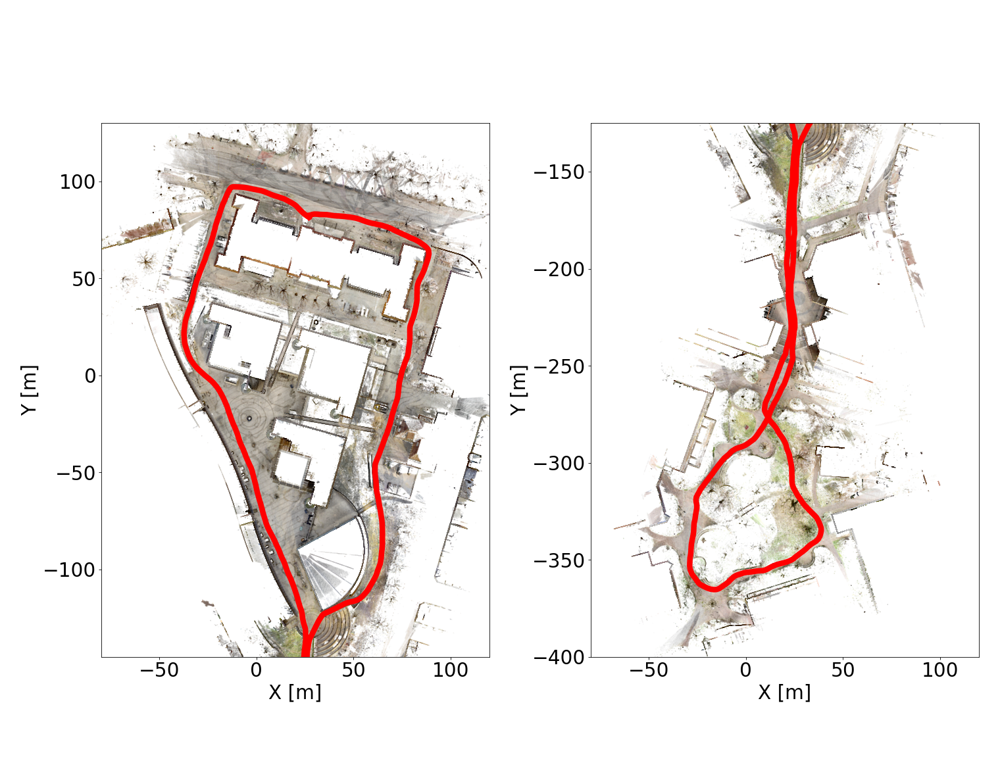</a></td>
      <td>-</td>
      <td><a href="https://drive.google.com/file/d/1raHVdY1F5tIkYc0y2DngEbZSAKNajxBI" rel="noopener noreferrer" target="_blank">d455b (20.5 GB)</a></td>
      <td><a href="https://drive.google.com/file/d/1LnKeiYqo06tq1k-SuCd-3oC7s3gvnflj" rel="noopener noreferrer" target="_blank">d455t (20.6 GB)</a></td>
      <td><a href="https://drive.google.com/file/d/1S6Gcwn96SvpdzC6aMxrHB02umTSpzd4m" rel="noopener noreferrer" target="_blank">mid70 (761 MB)</a></td>
      <td><a href="https://drive.google.com/file/d/1zTU8dnYNn1WRBGY-YkzqEiofH11vryTu" rel="noopener noreferrer" target="_blank">os1_64 (9.4 GB)</a></td>
      <td><a href="https://drive.google.com/file/d/18crbjWlLVZbo9C41LEIRvQ7Zc27UHrXe" rel="noopener noreferrer" target="_blank">ltpb (1 MB)</a></td>
      <td>-</td>
      <td><a href="https://drive.google.com/file/d/12SJQrHjFKNUMeoNuXNh7l0gd1w--B5Vl" rel="noopener noreferrer" target="_blank">vn200 (52 MB)</a></td>
    </tr>
    <tr>
      <th class="tg-mypc">14</th>
      <td><a href="https://drive.google.com/drive/folders/1Wby27hPjiWYfSHvULzIInChXxV8ISLVS" rel="noopener noreferrer" target="_blank">tuhh_day_04 </a>   Duration: 3m8s   Size: 12.5 GB</td>
      <td></td>
      <td>-</td>
      <td><a href="https://drive.google.com/file/d/1_N9RYr7EauzCH97yu9XvO5bw-AeUd_t-" rel="noopener noreferrer" target="_blank">d455b (5.1 GB)</a></td>
      <td><a href="https://drive.google.com/file/d/1jLteGEXqN5yXf86WqiUBCaZrjcBIVPSa" rel="noopener noreferrer" target="_blank">d455t (5.1 GB)</a></td>
      <td><a href="https://drive.google.com/file/d/1_cihEpkuxN_BSkYI224D9d3ps7xjfdJW" rel="noopener noreferrer" target="_blank">mid70 (178 MB)</a></td>
      <td><a href="https://drive.google.com/file/d/1IFzZoEyqjboOwntyiPHTUxGcBndE2e9S" rel="noopener noreferrer" target="_blank">os1_64 (2.2 GB)</a></td>
      <td><a href="https://drive.google.com/file/d/1pFahkNe_9-zQxNZ9sC86HvtJ-N7a7ou0" rel="noopener noreferrer" target="_blank">ltpb (318 KB)</a></td>
      <td>-</td>
      <td><a href="https://drive.google.com/file/d/1EToB3VXrxmoyPtdL1bnlFgG-fcegAIOt" rel="noopener noreferrer" target="_blank">vn200 (12 MB)</a></td>
    </tr>
    <tr>
      <th class="tg-mypc">15</th>
      <td><a href="https://drive.google.com/drive/folders/1FC9ckLRsJ48vvRPY2VJhQtFuT4qLIHo-" rel="noopener noreferrer" target="_blank">tuhh_night_07 </a>   Duration: 7m24s   Size: 10.2 GB</td>
      <td></td>
      <td>-</td>
      <td><a href="https://drive.google.com/file/d/1lGauAFszLU5JzVuevKx1Sr6JFcmgASfI" rel="noopener noreferrer" target="_blank">d455b (2.3 GB)</a></td>
      <td><a href="https://drive.google.com/file/d/1Id9WG_3Nk5agbut1dKFVxFsEJm-hXCGo" rel="noopener noreferrer" target="_blank">d455t (2.6 GB)</a></td>
      <td><a href="https://drive.google.com/file/d/10oblK7jfo-e5uDf94qRwwxMcKTxHmxTv" rel="noopener noreferrer" target="_blank">mid70 (388 MB)</a></td>
      <td><a href="https://drive.google.com/file/d/1y1GJkaofleWVU8ZoUByGkmXkq2lwm-k-" rel="noopener noreferrer" target="_blank">os1_64 (4.9 GB)</a></td>
      <td><a href="https://drive.google.com/file/d/1NyEIGBa9f3VsqQSJBt8Wo-qCqffcam8E" rel="noopener noreferrer" target="_blank">ltpb (623 KB)</a></td>
      <td>-</td>
      <td><a href="https://drive.google.com/file/d/1Ngy1_UXOfhjhwr-BEpG6Rsh1gi1rrMho" rel="noopener noreferrer" target="_blank">vn200 (28 MB)</a></td>
    </tr>
    <tr>
      <th class="tg-mypc">16</th>
      <td><a href="https://drive.google.com/drive/folders/1hBPyw1fXcOGeW98JCLL2nmZ-TCKxhqvt" rel="noopener noreferrer" target="_blank">tuhh_night_08 </a>   Duration: 11m49s   Size: 16.8 GB</td>
      <td><a href="https://drive.google.com/drive/u/1/folders/1c0aZmKB3JPdiyvn-809pSiZ6aPGaVyYf"> 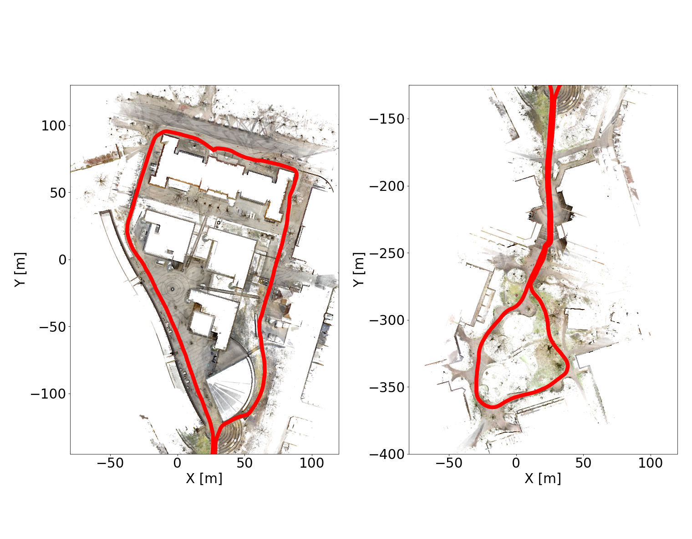</a></td>
      <td>-</td>
      <td><a href="https://drive.google.com/file/d/1ilQ4Npu0Y2WaSro4xJDcCqgk3iMSX4Bp" rel="noopener noreferrer" target="_blank">d455b (4.0 GB)</a></td>
      <td><a href="https://drive.google.com/file/d/1GaxDUF04_00x-qt_oYB78HxLjz3XrE9Y" rel="noopener noreferrer" target="_blank">d455t (4.2 GB)</a></td>
      <td><a href="https://drive.google.com/file/d/1p1BIv0cm96KybsnYp6aG7dFd1TvSi8Jl" rel="noopener noreferrer" target="_blank">mid70 (636 MB)</a></td>
      <td><a href="https://drive.google.com/file/d/16t33lVBzbSxrtt0vFt-ztWAxiciONWTX" rel="noopener noreferrer" target="_blank">os1_64 (7.9 GB)</a></td>
      <td><a href="https://drive.google.com/file/d/1wvsasGQgvuMeNg1QXeBzuLCq_rNvfGGV" rel="noopener noreferrer" target="_blank">ltpb (1 MB)</a></td>
      <td>-</td>
      <td><a href="https://drive.google.com/file/d/1bDjyQLINKWBVOg_7Q1n1mooUfM3VifOu" rel="noopener noreferrer" target="_blank">vn200 (44 MB)</a></td>
    </tr>
    <tr>
      <th class="tg-mypc">17</th>
      <td><a href="https://drive.google.com/drive/folders/1nEPiTXkVmLIhmBOVNpwSAEgnAXupnAxx" rel="noopener noreferrer" target="_blank">tuhh_night_09 </a>   Duration: 3m5s   Size: 3.5 GB</td>
      <td><a href="https://drive.google.com/drive/u/1/folders/1gEatbHzdiDBuDtCP0MyOzITEgj0HkOLs"> 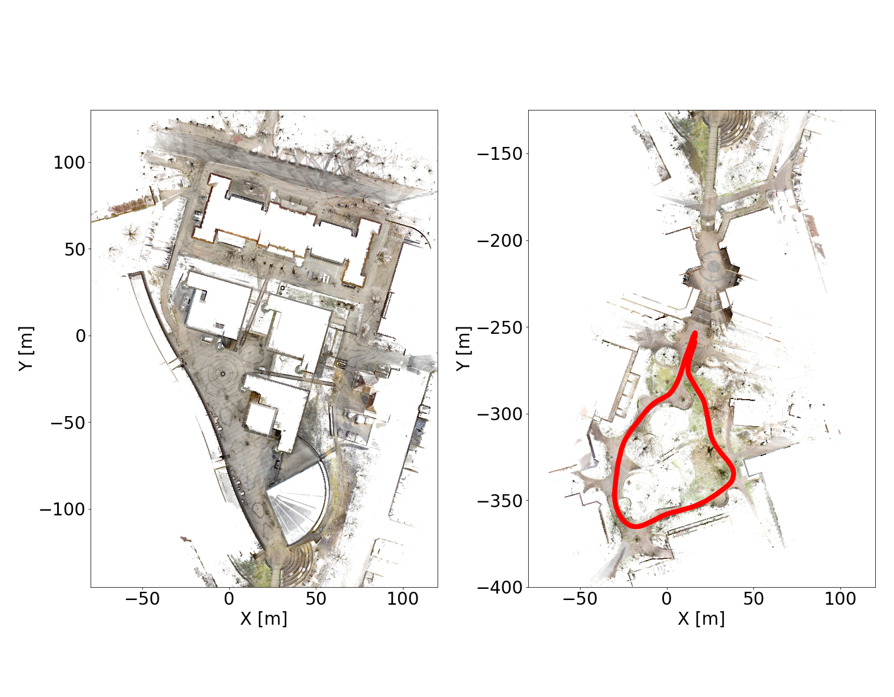</a></td>
      <td>-</td>
      <td><a href="https://drive.google.com/file/d/1VmHgEj6GI0mPhLOA-gJo1UG8G9FrM26c" rel="noopener noreferrer" target="_blank">d455b (632 MB)</a></td>
      <td><a href="https://drive.google.com/file/d/1mIp0weY6DPhdouJkqAiBIis2rYil5KJQ" rel="noopener noreferrer" target="_blank">d455t (605 MB)</a></td>
      <td><a href="https://drive.google.com/file/d/1-hZWGvZR0RmqKHehhjoQ44pkAhpCnktR" rel="noopener noreferrer" target="_blank">mid70 (176 MB)</a></td>
      <td><a href="https://drive.google.com/file/d/1_FsTTQe-NKvQ-1shlYNeG0uWqngA2XzC" rel="noopener noreferrer" target="_blank">os1_64 (2.1 GB)</a></td>
      <td><a href="https://drive.google.com/file/d/1eGRAqP5DpcIV7eAWawhaD5OCfZcJQlIG" rel="noopener noreferrer" target="_blank">ltpb (312 KB)</a></td>
      <td>-</td>
      <td><a href="https://drive.google.com/file/d/1jVQTmFX2pnYNULU5CjbOVa6hp_7zQoez" rel="noopener noreferrer" target="_blank">vn200 (12 MB)</a></td>
    </tr>
  </tbody>
</table>
