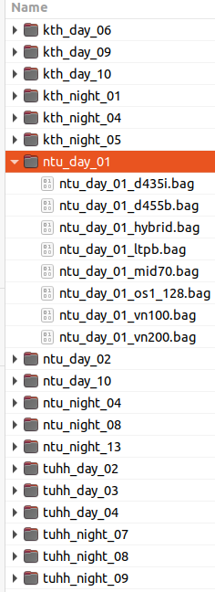

# Quick Use

## SLAM 

We assume that you have downloaded the rosbag files to a folder `/path/to/MCD` as in [Fig. 1](#data-organization):

<figure style="float: right; margin-left: 10px;">
  
  <figcaption id="data-organization">Fig. 1: Recommended organization of MCD data.</figcaption>
</figure>

Below are some SLAM methods that have been benchmarked on MCD. Please follow the installation instructions at each repository. After compiling, modify the `data_path` argument in the `run_mcdviral.launch`. Hence, you should be able to launch the experiment on an sequence MCD by `roslaunch fast_lio run_mcd.launch`.

* FAST_LIO: [https://github.com/brytsknguyen/FAST_LIO](https://github.com/brytsknguyen/FAST_LIO/blob/master/launch/run_mcdviral.launch)
* SLICT: [https://github.com/brytsknguyen/slict](https://github.com/brytsknguyen/slict/blob/master/launch/run_mcdviral.launch)
* DLIO: [https://github.com/brytsknguyen/dlio](https://github.com/brytsknguyen/slict/blob/master/launch/run_mcdviral.launch)
* CLIC (Lidar-Inertial-Odometry mode only): [https://github.com/brytsknguyen/clic](https://github.com/brytsknguyen/clic/blob/master/launch/run_mcdviral.launch)
  * Note: you will also have to set the path to `clic/config` folder [here](https://github.com/brytsknguyen/clic/blob/7369b0109a40fc8de9600ad22013603606b9aadb/config/ct_odometry_mcdviral_atv.yaml#L5) and [here](https://github.com/brytsknguyen/clic/blob/7369b0109a40fc8de9600ad22013603606b9aadb/config/ct_odometry_mcdviral_hhs.yaml#L5)