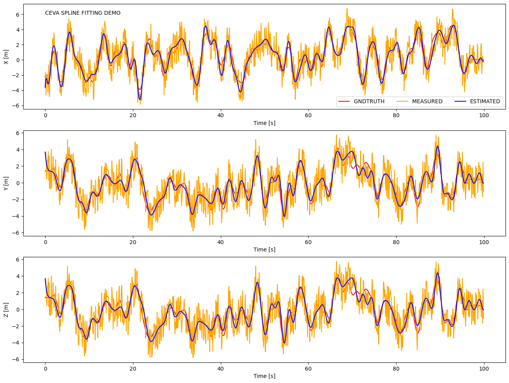

<p align="center">
    
</p>

# [MCD: Diverse Large-Scale Multi-Campus Dataset for Robot Perception](https://mcdviral.github.io)

The dataset is collected over large-scale campus areas in the Asia and Europe at different seasons, featuring:

* A comprehensive multi-sensor suite:
  + 3D spinning lidar
  + Non-repetItive lidar
  + Stereo cameras
  + High quality IMUs
  + UWB ranging sensors
* High resolution large scale survey-grade prior maps
  <p align="center">
    
    
    
  </p>
* Continuous-time ground truth and [B-Spline python wrapper with rich functionalities](https://github.com/mcdviral/ceva)
  <p align="center">
    
    
  </p>
* Semantic labels for non-repetitive lidar scans
  <p align="center">
    
    
    
  </p>
* Several examples on SOTA SLAM and learning methods.

# Notes:

If you have some inquiry, please raise an [issue](https://github.com/mcdviral/mcdviral.github.io/issues) on github.

# Licence
This work is licensed under a [Creative Commons Attribution-NonCommercial-ShareAlike 4.0 International License](https://creativecommons.org/licenses/by-nc-sa/4.0/) and is intended for non-commercial academic use.

If you find yourself or personal belongings in this dataset and feel unwell about it, please [contact us](mailto:mcdviral@gmail.com) and we will correct the issue.

# Citation
If you use any resource on this website in your work, please cite our work as:

```
@inproceedings{mcdviral2024,
  title        = {MCD: Diverse Large-Scale Multi-Campus Dataset for Robot Perception},
  author       = {Nguyen, Thien-Minh and Yuan, Shenghai and Nguyen, Thien Hoang and Yin, Pengyu and Cao, Haozhi and Xie, Lihua and Wozniak, Maciej and Jensfelt, Patric and Thiel, Marko and Ziegenbein, Justin and Blunder, Noel},
  booktitle    = {Proceedings of the IEEE/CVF Conference on Computer Vision and Pattern Recognition},
  license      = {CC BY-NC-SA 4.0},
  url          = {https://mcdviral.github.io/},
  version      = {1.0},
  year         = {2024},
  month        = {6}
}
```

# Updates
**27/02/2024**: Paper accepted to CVPR 2024. Full access is enabled.

**14/02/2023**: Preliminary release.
