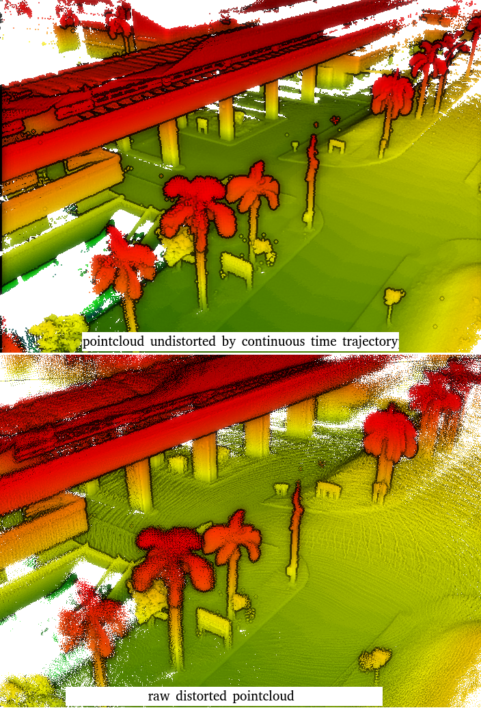

<p align="center">
    
</p>

# [MCD: Diverse Large-Scale Multi-Campus Dataset for Robot Perception](https://mcdviral.github.io)

The dataset is collected over large-scale campus areas in the Asia and Europe at different seasons, featuring:

* A comprehensive multi-sensor suite:
  + 3D spinning lidar
  + Non-repetItive lidar
  + Stereo cameras
  + High quality IMUs
  + UWB ranging sensors
* High resolution large scale survey-grade prior maps
  <p align="center">
    
    
  </p>
* Continuous-time ground truth and [B-Spline python wrapper with rich functionalities](https://github.com/mcdviral/ceva)
  <p align="center">
    
    
  </p>
* Semantic labels for non-repetitive lidar scans
  <p align="center">
    
    
    
  </p>
* Several examples on SOTA SLAM and learning methods.

# Notes:

If you have some inquiry, please raise an [issue](https://github.com/mcdviral/mcdviral.github.io/issues) on github.

# Licence
This work is licensed under a [Creative Commons Attribution-NonCommercial-ShareAlike 4.0 International License](https://creativecommons.org/licenses/by-nc-sa/4.0/) and is intended for non-commercial academic use.
If you are interested in using the dataset for commercial purposes please [contact us](mailto:mcdviral@gmail.com).

# Citation
If you use any resource on this website in your work, please cite our work as:

```
@software{mcdviral2023,
  author  = {Anonymous},
  title   = {MCD: Diverse Large-Scale Multi-Campus Dataset for Robot Perception},
  license = {CC BY-NC-SA 4.0},
  url     = {https://mcdviral.github.io/},
  version = {1.0},
  year    = {2023},
  month   = {11}
}
```

# Updates

**14/02/2023**: Preliminary release.
