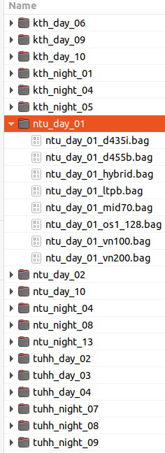
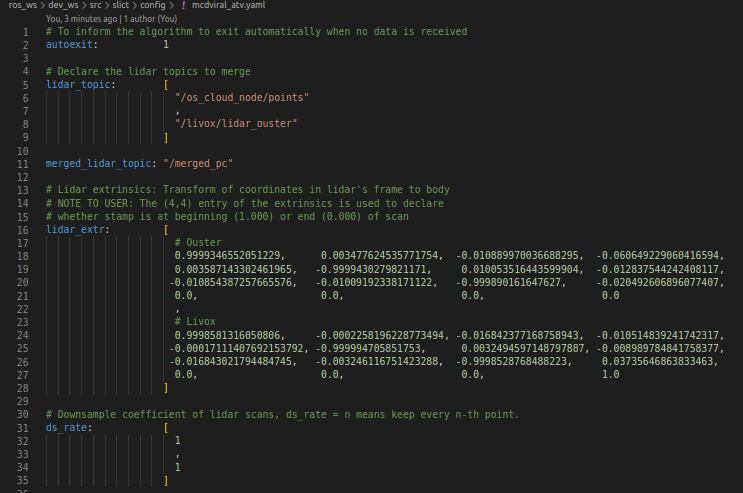
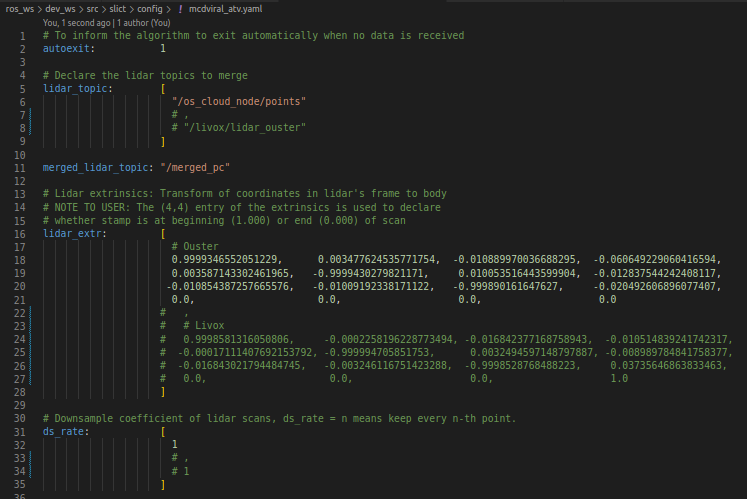
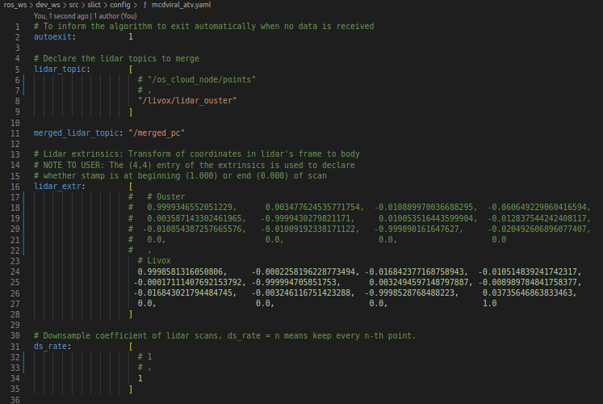

# SLAM Tutorial

<figure style="float: right; margin-left: 10px;">
  
  <figcaption id="data-organization">Fig. 1: Recommended organization of MCD data.</figcaption>
</figure>

We assume that you have downloaded the rosbag files to a folder `/path/to/MCD` as in [Fig. 1](#data-organization):

We try to create a consistent settings for the benchmark. Specifically, after compiling the code successfully, one only needs to seek out the `run_mcdviral.launch` file, modify the `data_path` and `bag_file` arguments, and then launch the method with `roslaunch <method> run_mcdviral.launch`. Some extra configurations for each method will also be noted.

## LIO methods

The methods below can be configured to work in ouster-only mode, livox-only mode, or merged ouster-livox mode.
If you are interested in having your method listed here. Please prepare your launch and configurations in the same manner and [contact us](mailto:mcdviral@gmail.com) to update this list.

### SLICT
  * Link: [https://github.com/brytsknguyen/slict](https://github.com/brytsknguyen/slict/blob/master/launch/run_mcdviral.launch)
  * **We recommend you test out this method successfully so that other methods can depend on some of its utilities.**
  * After successfully compiling the package, please modify the `data_path` argument in `run_mcdviral.launch` and launch it.
  * To configure SLICT to work with only ouster or livox, simply comment out the extrinsics in `slict/config/mcdviral_atv.yaml` and `slict/config/mcdviral_hhs.yaml` as follows.
  
  <div style="text-align:center;">
  <figure style="float: left; margin-right: 10px;">
      
      <figcaption>Config for merged pointcloud mode.</figcaption>
  </figure>
  <figure style="float: left; margin-right: 10px;">
      
      <figcaption>Config for ouster only mode.</figcaption>
  </figure>
  <figure style="float: left; margin-right: 10px;">
      
      <figcaption>Config for livox only mode.</figcaption>
  </figure>
  </div>
  
  <div style="clear:both;"></div>

### FAST_LIO
  * Link: [https://github.com/brytsknguyen/FAST_LIO](https://github.com/brytsknguyen/FAST_LIO/blob/master/launch/run_mcdviral.launch)
  * The included `run_mcdviral.launch` file uses `slict_livox_to_ouster` and `slict_merge_lidar` in SLICT to convert livox pointcloud to ouster and them merge it with the ouster pointcloud to make a single input. You can change the file `slict/config/mcdviral_atv.yaml` to run only the ouster or livox lidar as in the SLICT case.
  * Alternatively if you insist on running ouster (1 lidar only) and livox only without relying on SLICT, you can comment out the `slict_livox_to_ouster` and `slict_merge_lidar` nodes and change the config file in `run_mcdviral.launch`:
  ```html
      <!-- Chose the config file based on the sequence names -->
      <arg name="config_file" value="mcdviral_atv" if="$(eval 'ntu_'  in bag_file)" />
      <arg name="config_file" value="mcdviral_hhs" if="$(eval 'kth_'  in bag_file)" />
      <arg name="config_file" value="mcdviral_hhs" if="$(eval 'tuhh_' in bag_file)" />

      <rosparam command="load" file="$(find fast_lio)/config/$(arg config_file)_ouster.yaml" /> <!-- CHANGE TO _livox -->

      <!-- Run the livox to ouster converter -->
      <!-- <node pkg="slict" type="slict_livox_to_ouster" name="slict_livox_to_ouster" respawn="false" output="log" required="true"></node>   -->
      
      <!-- Create the merge pointcloud -->
      <!-- <node pkg="slict" type="slict_merge_lidar" name="slict_merge_lidar" respawn="true" output="screen" required="false">
          <rosparam file="$(find slict)/config/$(arg config_file).yaml" command="load"/>
      </node> -->
  ```

### DLIO
  * Link: [https://github.com/brytsknguyen/dlio](https://github.com/brytsknguyen/slict/blob/master/launch/run_mcdviral.launch)
  * Default config is for merged lidar mode. Configuration for ouster or livox lidar mode is similar to SLICT. Since DLIO is a direct method, there is no special feature extraction for either ouster or livox, we recommend that you keep `slict_livox_to_ouster` and `slict_merge_lidar` in the `run_mcdviral.launch` and only modify the extrinsics in `slict/config/mcdviral_atv.yaml` and `slict/config/mcdviral_hhs.yaml`to select the lidar type in single lidar mode.

### CLIC
  * Link: [https://github.com/brytsknguyen/clic](https://github.com/brytsknguyen/clic/blob/master/launch/run_mcdviral.launch)
  * Note: you will also have to set the path to `clic/config` folder [here](https://github.com/brytsknguyen/clic/blob/master/config/ct_odometry_mcdviral_atv.yaml#L5) and [here](https://github.com/brytsknguyen/clic/blob/master/config/ct_odometry_mcdviral_hhs.yaml#L5).
  * Currently the launch file is set to run with LIVOX only mode. To change to ouster, you can change the `lidar_odom_yaml` param at [here](https://github.com/brytsknguyen/clic/blob/master/config/ct_odometry_mcdviral_atv.yaml#L13C3-L13C18) and [here](https://github.com/brytsknguyen/clic/blob/master/config/ct_odometry_mcdviral_hhs.yaml#L13C3-L13C18).
  * To run with merged lidar, change the `lidar_odom_yaml` to `/mcdviral_atv/lidar_mcdviral.yaml` in the same way, and uncomment the following part in the launch file:
  ```html
    <!-- Run the livox to ouster converter -->
    <!-- <node pkg="slict" type="slict_livox_to_ouster" name="slict_livox_to_ouster" respawn="false" output="log" required="true"></node>   -->

    <!-- Create the merge pointcloud -->
    <!-- <node pkg="slict" type="slict_merge_lidar" name="slict_merge_lidar" respawn="true" output="screen" required="false">
      <rosparam file="$(find slict)/config/mcdviral_$(arg dataset_cfg).yaml" command="load"/>
    </node> -->
  ```
### LIO-SAM
  * Link: [https://github.com/brytsknguyen/LIO-SAM](https://github.com/brytsknguyen/LIO-SAM/blob/master/launch/run_mcdviral.launch)
  * The default configuration is with ouster lidar. Changing to merged pointcloud or livox pointcloud is similar to the previous cases.

## VIO methods

### VINS-Fusion

  * Link: [https://github.com/brytsknguyen/VINS-Fusion_Noetic_Focal](https://github.com/brytsknguyen/VINS-Fusion_Noetic_Focal/blob/master/vins_estimator/launch/run_mcdviral.launch)
  * The procedure is similar to LIO methods. Please clone the repo to your catkin workspace, build, and then set the path to MCD root under the `data_path` argument in the `run_mcdviral.launch` file.
  * If you encounter any problem please raise an issue on the repo.

### OPEN-VINS

  * Link: [https://github.com/brytsknguyen/open_vins](https://github.com/brytsknguyen/open_vins/blob/master/vins_estimator/launch/run_mcdviral.launch)
  * The procedure is similar to all of the above. Please clone the repo to your catkin workspace, build, and then set the path to MCD root under the `data_path` argument in the `run_mcdviral.launch` file.
  * If you encounter any problem please raise an issue on the repo.

### KIMERA

  * This method requires three repos
    * [Kimera-RPGO](https://github.com/brytsknguyen/Kimera-RPGO)
    * [Kimera-VIO](https://github.com/brytsknguyen/Kimera-VIO)
    * [Kimera-VIO-ROS](https://github.com/brytsknguyen/Kimera-VIO-ROS)
  * Please follow the official instructions to install the package. The `run_mcdviral.launch` file can be found in the [Kimera-VIO-ROS](https://github.com/brytsknguyen/Kimera-VIO-ROS/blob/master/launch/run_mcdviral.launch) package.
  * If you encounter any problem please raise an issue on the repo.


## Ranging-aided Methods
TBD
