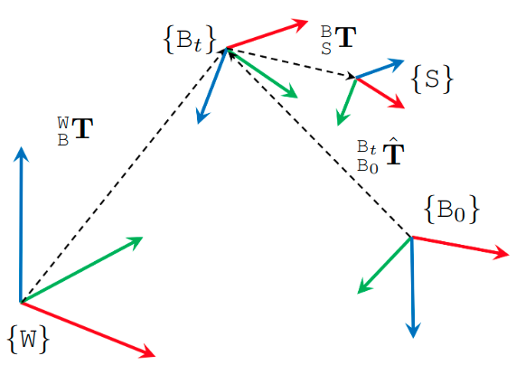

# User Manual

## Lidar data

### Resolution and rate

For the **xxx_** sequences, the ouster lidar has 128 channels with 1024 points per channel. For the **yyy_** and **zzz_** sequences, the ouster lidar has 64 channels with 1024 points per channel. In all sequences, the mid70 Livox lidar have one single non-repetitive line with 9980 points per line. All lidars output data at 10 Hz.

### Point format

**For ouster lidar**, the C++ definition of the point struct by the [PCL](https://pointclouds.org/) convention is as follows:

```
struct PointOuster
{
    PCL_ADD_POINT4D;
    float intensity;
    uint32_t t;
    uint16_t reflectivity;
    uint16_t ambient;
    uint32_t range;
    uint8_t  ring;
    EIGEN_MAKE_ALIGNED_OPERATOR_NEW
} EIGEN_ALIGN16;
POINT_CLOUD_REGISTER_POINT_STRUCT(PointOuster,
                                 (float, x, x) (float, y, y) (float, z, z)
                                 (float, intensity, intensity)
                                 (uint32_t, t, t)
                                 (uint16_t, reflectivity, reflectivity)
                                 (uint16_t, ambient, ambient)
                                 (uint32_t, range, range)
                                 (uint8_t,  ring, ring)
)
```

For python programming, we recommend using the [pypcd](https://github.com/mcdviral/pypcd) package, which can read the pointcloud directly from ROS message into structured numpy array with the field names intact. Please find the demo [here](https://github.com/mcdviral/ceva/blob/master/scripts/deskew_demo.ipynb).

**For livox lidar**, the point has a custom structuure that is defined by the manufacturer as follows:

```
# Livox costum pointcloud format.

uint32 offset_time      # offset time relative to the base time
float32 x               # X axis, unit:m
float32 y               # Y axis, unit:m
float32 z               # Z axis, unit:m
uint8 reflectivity      # reflectivity, 0~255
uint8 tag               # livox tag
uint8 line              # laser number in lidar
```

Please follows the instructions [here](https://github.com/Livox-SDK/livox_ros_driver) to install the livox driver, after which you should be able to import and manipulate the livox message in ROS python or C++ program.


### Time stamp
For MCD, please take note of the following:

* For the ouster data, the timestamp in the message header corresponds to the *end* of the 0.1s sweep. Let us denote it as $$t_h$$. Each lidar point has a timestamp (in nanosecond) that is relative to the *start* of the sweep, denoted as $$t_r$$. The absolute time of the point $$t_a$$ is therefore:

$$
t_{a} = t_{h} - 0.1 + t_{r}/\mathrm{1.0e9}
$$

* For the livox data, the timestamp in the message header corresponds to the *start* of the 0.1s sweep. We us denote it as $$t_h$$. Each lidar point has a timestamp (in nanosecond) that is relative to the *start* of the sweep, denoted asc $$t_r$$. The absolute time of the point $$t_a$$ is therefore:

$$
t_{a} = t_{h} + t_{r}/\mathrm{1.0e9}
$$

## Coordinate systems

The main coordinate systems in MCD is defined as follows:
  
<p align="center">
  
</p>

First, the coordinate system of the [prior maps](Groundtruth#survey-grade-prior-map) is referred to as the *World* frame $$\mathtt{W}$$.
Then the *Body* frame $$\mathtt{B}$$ coincides with the VN100 IMU in the XXX sequences, and the VN200 in the YYY and ZZZ sequences.
Each sensor has a *Sensor* frame $${\mathtt{S}}$$ attached to it.

The extrinsics of the sensors in MCD are declared as transformation matrices $${}^{\mathtt{B}}_{\mathtt{S}}\bf{T} = \begin{bmatrix} {}^{\mathtt{B}}_{\mathtt{S}}\mathrm{R} & {}^{\mathtt{B}}_{\mathtt{S}}\mathrm{t} \\ 0 &1\end{bmatrix} $$, where $${}^{\mathtt{B}}_{\mathtt{S}}\mathrm{R}$$ and $${}^{\mathtt{B}}_{\mathtt{S}}\mathrm{t}$$ are respectively the rotational and translational extrinsics.

Therefore if one observes a landmark $${}^{\mathtt{C}}\mathrm{f}$$ in the camera frame $$\mathtt{C}$$, its coordinate in the body frame $${}^{\mathtt{B}}\mathrm{f}$$ is calculated as:

$${}^{\mathtt{B}}\mathrm{f} = {}^{\mathtt{B}}_{\mathtt{C}}\mathrm{R} {}^{\mathtt{C}}\mathrm{f} + {}^{\mathtt{B}}_{\mathtt{C}}\mathrm{t}$$

The ground truth data in our csv files are the poses $$({}^{\mathtt{W}}_{\mathtt{B}_t}\mathrm{q}, {}^{\mathtt{W}}_{\mathtt{B}_t}\mathrm{p})$$, where $${}^{\mathtt{W}}_{\mathtt{B}_t}\mathrm{q}$$ and $${}^{\mathtt{W}}_{\mathtt{B}_t}\mathrm{p}$$ are the orientation (in quaternion) and position of the body frame at time t relative to the world frame.

In most cases, the SLAM estimate $${}^{\mathtt{B}_0}_{\mathtt{B}_t}\hat{\bf{T}}$$ is relative to the coordinate frame that coincides with the body frame at initial time. It is therefore neccessary to align the SLAM estimate with the groundtruth. The [evo package](https://github.com/MichaelGrupp/evo) is a popular tool for this task.

<!-- calculate the error of the pose estimates $${}^{\mathtt{B}}_{\mathtt{S}}\hat{\bf{T}}$$ -->


## ROS topics

Below are the topics of each sensor modality in MCD. The naming convention `**/\<hardware-unit\>/\<modality\>/...**' is applied for all topics in both the ATV and HHS setups. Note that the 't' and 'b' affixes in the names of the realsense D455 modules refer to 'top' and 'bottom' units. They do not mean a hardware variant.

<style type="text/css">
.tg  {border-collapse:collapse;border-spacing:0;}
.tg td{border-color:black;border-style:solid;border-width:1px;font-family:Arial, sans-serif;font-size:14px;
  overflow:hidden;padding:10px 5px;word-break:normal;}
.tg th{border-color:black;border-style:solid;border-width:1px;font-family:Arial, sans-serif;font-size:14px;
  font-weight:normal;overflow:hidden;padding:10px 5px;word-break:normal;}
.tg .tg-c3ow{border-color:inherit;text-align:center;vertical-align:top}
.tg .tg-7btt{border-color:inherit;font-weight:bold;text-align:center;vertical-align:top}
.tg .tg-0pky{border-color:inherit;text-align:left;vertical-align:top}
</style>
<table class="tg" align="center">
<thead>
  <tr>
    <th class="tg-7btt" rowspan="2">Modality</th>
    <th class="tg-7btt" rowspan="2">Hardware Unit</th>
    <th class="tg-7btt" colspan="2">ROS topics / Sensor suite</th>
    <th class="tg-7btt" rowspan="2">Message type</th>
    <th class="tg-7btt" rowspan="2">Rate<br>(Hz)</th>
  </tr>
  <tr>
    <th class="tg-7btt">ATV</th>
    <th class="tg-7btt">HSS</th>
  </tr>
</thead>
<tbody>
  <tr>
    <td class="tg-7btt" rowspan="3">Camera</td>
    <td class="tg-0pky">D435i</td>
    <td class="tg-0pky">/d435i/infra1/image_rect_raw<br><span style="font-weight:400;font-style:normal">/d435i/infra2/image</span>_<span style="font-weight:400;font-style:normal">rect</span>_raw</td>
    <td class="tg-0pky">-</td>
    <td class="tg-0pky" rowspan="3"><a href="https://docs.ros.org/en/noetic/api/sensor_msgs/html/msg/Image.html" target="_blank" rel="noopener noreferrer">sensor_msgs/Image</a></td>
    <td class="tg-c3ow">30</td>
  </tr>
  <tr>
    <td class="tg-0pky">D455t</td>
    <td class="tg-0pky">-</td>
    <td class="tg-0pky">/d455t/infra1/image_rect_raw<br><span style="font-weight:400;font-style:normal">/d455t/infra2/image</span>_<span style="font-weight:400;font-style:normal">rect</span>_raw<br><span style="font-weight:400;font-style:normal">/d455t/color/image_raw</span></td>
    <td class="tg-c3ow">30</td>
  </tr>
  <tr>
    <td class="tg-0pky">D455b</td>
    <td class="tg-0pky">/d455b/infra1/image_rect_raw<br><span style="font-weight:400;font-style:normal">/d455b/infra2/image</span>_<span style="font-weight:400;font-style:normal">rect</span>_raw<br><span style="font-weight:400;font-style:normal">/d455b/color/image_raw</span></td>
    <td class="tg-0pky">/d455b/infra1/image_rect_raw<br><span style="font-weight:400;font-style:normal">/d455b/infra2/image</span>_<span style="font-weight:400;font-style:normal">rect</span>_raw<br><span style="font-weight:400;font-style:normal">/d455b/color/image_raw</span></td>
    <td class="tg-c3ow">30</td>
  </tr>
  <tr>
    <td class="tg-7btt" rowspan="6">IMU</td>
    <td class="tg-0pky">Ouster OS1</td>
    <td class="tg-0pky">/os cloud node/imu</td>
    <td class="tg-0pky">/os cloud node/imu</td>
    <td class="tg-0pky" rowspan="6"><a href="https://docs.ros.org/en/noetic/api/sensor_msgs/html/msg/Imu.html" target="_blank" rel="noopener noreferrer">sensor_msgs/Imu</a></td>
    <td class="tg-c3ow">100</td>
  </tr>
  <tr>
    <td class="tg-0pky">D435i</td>
    <td class="tg-0pky">/d435i/imu</td>
    <td class="tg-0pky">-</td>
    <td class="tg-c3ow">400</td>
  </tr>
  <tr>
    <td class="tg-0pky">D455t</td>
    <td class="tg-0pky">-</td>
    <td class="tg-0pky">/d455t/imu</td>
    <td class="tg-c3ow">400</td>
  </tr>
  <tr>
    <td class="tg-0pky">D455b</td>
    <td class="tg-0pky">/d455b/imu</td>
    <td class="tg-0pky">/d455b/imu</td>
    <td class="tg-c3ow">400</td>
  </tr>
  <tr>
    <td class="tg-0pky">VN100</td>
    <td class="tg-0pky">/vn100/imu</td>
    <td class="tg-0pky">-</td>
    <td class="tg-c3ow">400</td>
  </tr>
  <tr>
    <td class="tg-0pky">VN200</td>
    <td class="tg-0pky">/vn200/imu</td>
    <td class="tg-0pky">/vn200/imu</td>
    <td class="tg-c3ow">400</td>
  </tr>
  <tr>
    <td class="tg-7btt" rowspan="2">Lidar</td>
    <td class="tg-0pky">Ouster OS1</td>
    <td class="tg-0pky">/os cloud node/points</td>
    <td class="tg-0pky">/os cloud node/points</td>
    <td class="tg-0pky"><a href="https://docs.ros.org/en/noetic/api/sensor_msgs/html/msg/PointCloud2.html" target="_blank" rel="noopener noreferrer">sensor_msgs/PointCloud2</a></td>
    <td class="tg-c3ow">10</td>
  </tr>
  <tr>
    <td class="tg-0pky">Livox Mid70</td>
    <td class="tg-0pky">/livox/lidar</td>
    <td class="tg-0pky">/livox/lidar</td>
    <td class="tg-0pky"><a href="https://github.com/Livox-SDK/livox_ros_driver/blob/master/livox_ros_driver/msg/CustomMsg.msg" target="_blank" rel="noopener noreferrer">livox_ros_driver/CustomMsg.msg</a></td>
    <td class="tg-c3ow">10</td>
  </tr>
  <tr>
    <td class="tg-7btt">UWB</td>
    <td class="tg-0pky">Link Track P</td>
    <td class="tg-0pky"><span style="font-weight:400;font-style:normal">/ltp tag0/nlnf3</span><br><span style="font-weight:400;font-style:normal">/ltp tag1/nlnf3</span></td>
    <td class="tg-0pky"><span style="font-weight:400;font-style:normal">/ltp tag0/nlnf3</span><br><span style="font-weight:400;font-style:normal">/ltp tag1/nlnf3</span></td>
    <td class="tg-0pky"><a href="https://github.com/nooploop-dev/nlink_parser/blob/master/msg/LinktrackNodeframe3.msg" target="_blank" rel="noopener noreferrer">nlink_parser/LinktrackNodeframe3</a></td>
    <td class="tg-c3ow">20</td>
  </tr>
  <tr>
    <td class="tg-7btt">GPS</td>
    <td class="tg-0pky">VN200</td>
    <td class="tg-0pky">/vn200/GPS</td>
    <td class="tg-0pky">-</td>
    <td class="tg-0pky"><a href="https://docs.ros.org/en/noetic/api/sensor_msgs/html/msg/NavSatFix.html" target="_blank" rel="noopener noreferrer">sensor_msgs/NavSatFix</a></td>
    <td class="tg-c3ow">400</td>
  </tr>
</tbody>
</table>
